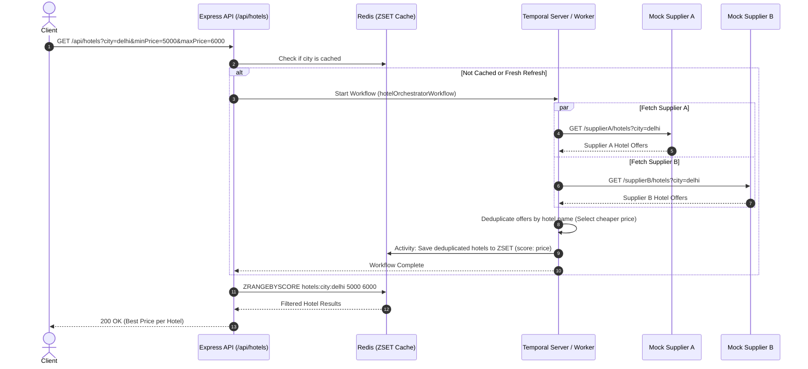

# Hotel Offer Orchestrator

A distributed hotel aggregation and orchestration service built with **Node.js (TypeScript)**, **Express**, **Temporal.io**, **Redis**, and **Docker Compose**.

The system aggregates hotel offers in parallel from multiple suppliers (Supplier A and Supplier B), eliminates duplicate listings by name, picks the best available offer per hotel (cheapest price, with commission details), caches and filters results using Redis Sorted Sets, and provides fault tolerance via Temporal workflows.

---

## Table of Contents

- [Architecture Overview](#architecture-overview)
- [Tech Stack](#tech-stack)
- [Key Features](#key-features)
- [Endpoints & API Specification](#endpoints--api-specification)
  - [1. Hotel Search & Price Filter](#1-get-apihotels)
  - [2. Mock Supplier APIs](#2-mock-supplier-apis)
  - [3. Supplier Downtime Simulation](#3-supplier-downtime-simulation)
  - [4. Health Check Endpoint](#4-health-check-endpoint-health)
- [Redis Price Range Filtering](#redis-price-range-filtering)
- [Temporal Workflow & Fault Tolerance](#temporal-workflow--fault-tolerance)
- [Quick Start with Docker Compose](#quick-start-with-docker-compose)
- [Local Development Setup](#local-development-setup)
- [Running Automated Tests](#running-automated-tests)
- [Testing with Postman](#testing-with-postman)
- [Submission Checklist Verification](#submission-checklist-verification)

---

## Architecture Overview



---

## Tech Stack

| Technology | Purpose |
|------------|---------|
| **Node.js (v20+) & TypeScript** | Strongly typed server runtime |
| **Express** | REST API framework for endpoints & mock supplier services |
| **Temporal.io** | Distributed workflow engine orchestrating parallel supplier fetching, activity retries, and data persistence |
| **Redis (ioredis)** | High-performance in-memory cache and Sorted Set (`ZSET`) price range filter |
| **Docker & Docker Compose** | Containerized deployment of App, Temporal Server, Temporal Web UI, and Redis |
| **Vitest & Supertest** | Automated unit and integration testing suite |
| **Pino** | Structured JSON logging |
| **Zod** | Request query parameter validation and schema safety |

---

## Key Features

1. **Parallel Supplier Aggregation**: Calls Supplier A and Supplier B concurrently using Temporal activities.
2. **Deterministic Best-Price Deduplication**:
   - Identifies hotels by name.
   - For hotels offered by both suppliers, selects the offer with the lower price.
   - Preserves winning supplier name (`"Supplier A"` or `"Supplier B"`) and `commissionPct`.
   - If only one supplier returns a hotel, that offer is retained.
3. **In-Redis Price Filtering**: Deduplicated hotel offers are stored in a Redis Sorted Set (`ZSET`) with their price as the score. Queries with `minPrice` and `maxPrice` query parameters execute `ZRANGEBYSCORE` directly inside Redis.
4. **Fault Tolerance & Graceful Degradation**:
   - Temporal activity retries with exponential backoff.
   - If one supplier fails or is simulated down, the workflow does not crash; it logs the issue, proceeds with the remaining available supplier, and delivers all available offers to the client.
5. **Comprehensive Health Check (`/health`)**: Reports the live connectivity, latency, and status of Supplier A, Supplier B, Redis, and Temporal.
6. **Built-in Mock Supplier APIs & Outage Simulation**: Mock endpoints for Supplier A and B with overlapping hotel listings, plus runtime endpoints to simulate supplier downtime.

---

## Endpoints & API Specification

### 1. `GET /api/hotels`

Retrieves de-duplicated hotel offers for a given city, with optional price filtering inside Redis.

#### Query Parameters:
- `city` (string, **required**): Name of the city (e.g., `delhi`, `mumbai`). Case-insensitive.
- `minPrice` (number, *optional*): Minimum price filter.
- `maxPrice` (number, *optional*): Maximum price filter (must be $\ge$ `minPrice`).
- `fresh` (boolean, *optional*): Set `true` to force a live Temporal workflow execution and refresh Redis cache.

#### Request Example:
```http
GET /api/hotels?city=delhi&minPrice=5000&maxPrice=6000 HTTP/1.1
Host: localhost:3000
```

#### Response Example:
```json
[
  {
    "name": "Holtin",
    "price": 5340,
    "supplier": "Supplier B",
    "commissionPct": 20
  },
  {
    "name": "Radison",
    "price": 5900,
    "supplier": "Supplier A",
    "commissionPct": 13
  }
]
```

---

### 2. Mock Supplier APIs

#### `GET /supplierA/hotels?city=delhi`
#### `GET /supplierB/hotels?city=delhi`

Returns supplier-specific offers formatted as:
```json
[
  {
    "hotelId": "a1",
    "name": "Holtin",
    "price": 6000,
    "city": "delhi",
    "commissionPct": 10
  }
]
```

#### Overlapping Data Comparison in Delhi:
| Hotel Name | Supplier A Price | Supplier B Price | Winner | Selected Price | Selected Supplier |
|------------|------------------|------------------|--------|----------------|-------------------|
| **Holtin** | ₹6,000 (10%) | **₹5,340 (20%)** | Supplier B | ₹5,340 | Supplier B |
| **Radison** | **₹5,900 (13%)** | ₹6,200 (11%) | Supplier A | ₹5,900 | Supplier A |
| **Hyatt Regency** | ₹7,800 (15%) | **₹7,400 (14%)** | Supplier B | ₹7,400 | Supplier B |
| **Taj Palace** | **₹9,500 (12%)** | *Not Offered* | Supplier A | ₹9,500 | Supplier A |
| **Marriott Aerocity** | *Not Offered* | **₹7,200 (16%)** | Supplier B | ₹7,200 | Supplier B |
| **The Oberoi** | **₹12,000 (15%)** | ₹12,500 (10%) | Supplier A | ₹12,000 | Supplier A |
| **Leela Palace** | *Not Offered* | **₹10,500 (17%)** | Supplier B | ₹10,500 | Supplier B |

---

### 3. Supplier Downtime Simulation

Allows testing fault tolerance and supplier outages without restarting the application:

- **Simulate Supplier A Outage:**
  ```http
  POST /supplierA/simulate-down
  Content-Type: application/json

  { "down": true }
  ```
- **Restore Supplier A:**
  ```http
  POST /supplierA/simulate-down
  Content-Type: application/json

  { "down": false }
  ```
- **Reset Both Suppliers:**
  ```http
  POST /suppliers/reset
  ```

---

### 4. Health Check Endpoint (`/health`)

Informs about the live health of both mock suppliers, Redis, and Temporal.

#### Request Example:
```http
GET /health HTTP/1.1
Host: localhost:3000
```

#### Healthy Response Example (`200 OK`):
```json
{
  "status": "UP",
  "timestamp": "2026-09-30T16:30:00.000Z",
  "services": {
    "supplierA": {
      "status": "UP",
      "latencyMs": 4
    },
    "supplierB": {
      "status": "UP",
      "latencyMs": 5
    },
    "redis": {
      "status": "UP",
      "latencyMs": 2
    },
    "temporal": {
      "status": "UP",
      "latencyMs": 6
    }
  }
}
```

#### Degraded Response Example (`200 OK` when Supplier A is down):
```json
{
  "status": "DEGRADED",
  "timestamp": "2026-09-30T16:32:00.000Z",
  "services": {
    "supplierA": {
      "status": "DOWN",
      "message": "Supplier A is marked DOWN (Simulated Downtime)"
    },
    "supplierB": {
      "status": "UP",
      "latencyMs": 4
    },
    "redis": {
      "status": "UP",
      "latencyMs": 2
    },
    "temporal": {
      "status": "UP",
      "latencyMs": 5
    }
  }
}
```

---

## Redis Price Range Filtering

1. **Storage Mechanism**:
   - Key: `hotels:city:<city_name>`
   - Data structure: **Sorted Set (`ZSET`)**
   - **Score**: Hotel `price` (numerical)
   - **Member**: JSON string containing `{ name, price, supplier, commissionPct }`
2. **Filtering Execution**:
   - `ZRANGEBYSCORE hotels:city:delhi <minPrice> <maxPrice>`
   - Natural $O(\log(N) + M)$ complexity natively handled by Redis engine.
   - Auto-sorted in ascending order by price.
   - Cache TTL defaults to 3600 seconds (configurable via `REDIS_TTL_SECONDS`).

---

## Temporal Workflow & Fault Tolerance

- **Workflow Name**: `hotelOrchestratorWorkflow(city: string)`
- **Task Queue**: `HOTEL_OFFER_TASK_QUEUE`
- **Activities**:
  - `fetchSupplierAHotels(city)`
  - `fetchSupplierBHotels(city)`
  - `saveHotelsToRedisActivity(city, deduplicatedHotels)`
- **Parallelism**: Activities execute concurrently via `Promise.allSettled`.
- **Retry Policy**:
  - `maximumAttempts`: 2
  - `initialInterval`: 500ms
  - `backoffCoefficient`: 1.5
- **Resilience**: If Supplier A fails or is marked down, the workflow logs the incident, falls back to Supplier B's results, saves to Redis, and returns all available deals.

---

## Quick Start with Docker Compose

Deploy the entire stack with a single command:

```bash
docker compose up --build
```

### Services Started:
- **Express App & Worker**: `http://localhost:3000`
- **Temporal Web UI**: `http://localhost:8080`
- **Temporal Server (gRPC)**: `localhost:7233`
- **Redis Server**: `localhost:6379`

To shut down:
```bash
docker compose down
```

---

## Local Development Setup

### Prerequisites
- Node.js 20+
- npm 10+
- Optional: Local Redis and Temporal instances (or let the app run in resilient direct mode)

### 1. Install Dependencies
```bash
npm install
```

### 2. Configure Environment Variables
Copy `.env.example` to `.env`:
```bash
cp .env.example .env
```

### 3. Run the Development Server
```bash
npm run dev
```

### 4. Build for Production
```bash
npm run build
npm start
```

---

## Running Automated Tests

The project includes an end-to-end Vitest test suite covering deduplication, Redis filtering, mock supplier endpoints, downtime simulation, and API validation:

```bash
npm test
```

Expected output:
```
✓ tests/deduplication.test.ts (7 tests)
✓ tests/redis.test.ts (6 tests)
✓ tests/suppliers.test.ts (6 tests)
✓ tests/api.test.ts (8 tests)

Test Files  4 passed (4)
Tests  27 passed (27)
```

---

## Testing with Postman

A ready-to-run Postman collection is included in the root directory:
📁 [`Hotel_Offer_Orchestrator.postman_collection.json`](./Hotel_Offer_Orchestrator.postman_collection.json)

### Included Requests:
1. `1. Orchestrated Hotels - Valid City (delhi)`: Verifies deduplication and best price selection.
2. `2. Orchestrated Hotels - Price Filter (5000 to 6000)`: Tests Redis ZSET range filtering.
3. `3. Orchestrated Hotels - City with No Results (atlantis)`: Returns `[]`.
4. `4. Direct Supplier A - Delhi Offers`: Validates Supplier A mock data.
5. `5. Direct Supplier B - Delhi Offers`: Validates Supplier B mock data.
6. `6. Simulate Supplier A Down`: Triggers simulated outage for Supplier A.
7. `7. Health Check - Degraded Status`: Confirms `/health` reports DEGRADED with Supplier A DOWN.
8. `8. Orchestrated Hotels - Resilience Check with Supplier A Down`: Confirms workflow still returns Supplier B offers.
9. `9. Restore Supplier A to Online`: Brings Supplier A back online.
10. `10. Health Check - All Healthy`: Confirms all services report UP.
11. `11. Validation Error - Missing City`: Expects 400 Bad Request.
12. `12. Validation Error - minPrice Greater Than maxPrice`: Expects 400 Bad Request.

---

## Submission Checklist Verification

- [x] **Source code**: Complete Node.js (TypeScript) implementation in `src/`.
- [x] **Dockerfile**: Multi-stage production build in `Dockerfile`.
- [x] **Docker Compose**: Multi-container orchestration in `docker-compose.yml`.
- [x] **README.md**: Complete setup, architecture, and deployment instructions.
- [x] **Postman Collection file**: `Hotel_Offer_Orchestrator.postman_collection.json`.
- [x] **Temporal Orchestration**: Parallel supplier calls and deduplication workflow.
- [x] **Redis Price Filtering**: Filtered inside Redis Sorted Sets via `ZRANGEBYSCORE`.
- [x] **Health Check Endpoint (`/health`)**: Full diagnostics for both suppliers, Redis, and Temporal.
- [x] **Logging & Error Handling**: Structured logging via Pino and resilient activity retry policies.
